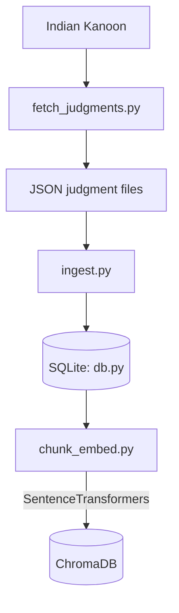

# NyayaSetu MVP: Full Technical Flow (V2)

There are two different kinds of data moving through the system:
1. **Legal data** – judgments, chunks, embeddings, retrieved evidence.
2. **Control/instruction data** – prompts, model options, citation rules, thresholds.

---

## 1. The Offline Data Preparation



* **Metadata Integrity**: When chunks are saved to ChromaDB, the `case_id`, `court`, `date`, and `title` are securely embedded into the ChromaDB metadata payload.

## 2. The Retrieval & Generation Pipeline

```mermaid
flowchart TD
    User(User enters question) --> App(app.py)
    App --> RagChain(rag_chain.py)
    RagChain --> Search(search.py)
    
    Search --> |1. Semantic| Chroma[(ChromaDB)]
    Search --> |2. Keyword| SQLite[(SQLite FTS5)]
    
    Chroma --> Hits[hits dictionary]
    SQLite --> Hits
    
    Hits --> RagChain
    RagChain --> |JSON Prompt Formulation| LLM[Groq OR Ollama]
    LLM --> JSONResponse[{"answer": "...", "citations": [{"evidence_quote": "..."}]}]
    
    JSONResponse --> Mapping(Python Mapping Logic)
    Mapping --> |Matches quotes to Hits metadata| MappedText[Text with [CASE: xxx] appended]
    
    MappedText --> Verifier(citation_verifier.py)
    Verifier --> UI(Streamlit UI displays valid citations)
```

## 3. Data Schema & Thresholds

- **Embeddings**: `all-MiniLM-L6-v2` (Inherently L2-normalized to 1.0 length).
- **ChromaDB Metric**: Squared L2 distance (`l2`).
- **Semantic Threshold**: `0.55` in the code evaluates to `score = 1 - dist`. Because vectors are normalized ($dist = 2 - 2 * cos\_sim$), this threshold mathematically equates to a cosine similarity cutoff of `0.775`.
